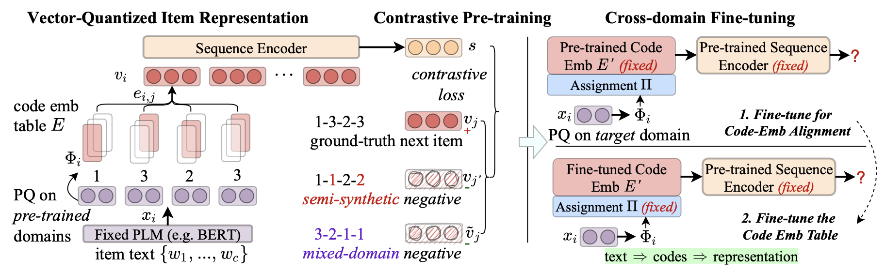

# VQ-Rec

PyTorch implementation of the [paper](https://arxiv.org/abs/2210.12316)
> Yupeng Hou, Zhankui He, Julian McAuley, Wayne Xin Zhao. Learning Vector-Quantized Item Representation for Transferable Sequential Recommenders. TheWebConf 2023.

---

*Updates*:

* [Mar. 27, 2023] We fixed two minor bugs in pre-training (Raised by [UniSRec#9](https://github.com/RUCAIBox/UniSRec/pull/9) and an email from Xingyu Lu, respectively. Thanks a lot!!). We pre-trained VQ-Rec again and the new pre-trained model has been uploaded as `pretrained/VQRec-FHCKM-300-20230315.pth`. We also evaluated the new pre-trained model on six downstream datasets. Generally, the new pre-trained model performs better. Please refer to [Results](#results) for more details.

## Overview

Recently, the generality of natural language text has been leveraged to develop transferable recommender systems. The basic idea is to employ pre-trained language model~(PLM) to encode item text into item representations. Despite the promising transferability, the binding between item text and item representations might be "*too tight*", leading to potential problems such as over-emphasizing the effect of text features and exaggerating the negative impact of domain gap. To address this issue, this paper proposes **VQ-Rec**, a novel approach to learning <ins>V</ins>ector-<ins>Q</ins>uantized item representations for transferable sequential <ins>Rec</ins>ommender. The major novelty of our approach lies in the new item representation scheme: it first maps item text into a vector of discrete indices (called *item code*), and then employs these indices to lookup the code embedding table for deriving item representations. Such a scheme can be denoted as "*text* ==> *code* ==> *representation*". Based on this representation scheme, we further propose an enhanced contrastive pre-training approach, using semi-synthetic and mixed-domain code representations as hard negatives. Furthermore, we design a new cross-domain fine-tuning method based on a differentiable permutation-based network.



## Requirements

```
recbole==1.0.1
faiss-gpu==1.7.2
python==3.8.13
cudatoolkit==11.3.1
pytorch==1.11.0
```


### Dataset

link：https://pan.baidu.com/s/19SKMra38e24eFWDnwBghbA 
code：6666 

After unzipping, move  to `dataset/`, and move `VQRec-FHCKM-300-20230315` to `saved/`.


### Quick Start

 To run the program, try the script given in '/train/.

- **Books**

```
bash train/Books.sh
```

- **Movies_and_TV**

```
bash train/Movie.sh
```

- **CDs_and_Vinyl**

```
bash train/CD.sh
```


## Acknowledgement

The implementation is based on [UniSRec](https://github.com/RUCAIBox/UniSRec) and the open-source recommendation library [RecBole](https://github.com/RUCAIBox/RecBole).

Please cite the following papers as references if you use our implementations or the processed datasets.

```bibtex
@inproceedings{hou2023vqrec,
  author = {Yupeng Hou and Zhankui He and Julian McAuley and Wayne Xin Zhao},
  title = {Learning Vector-Quantized Item Representation for Transferable Sequential Recommenders},
  booktitle={{TheWebConf}},
  year = {2023}
}

@inproceedings{zhao2021recbole,
  title={Recbole: Towards a unified, comprehensive and efficient framework for recommendation algorithms},
  author={Wayne Xin Zhao and Shanlei Mu and Yupeng Hou and Zihan Lin and Kaiyuan Li and Yushuo Chen and Yujie Lu and Hui Wang and Changxin Tian and Xingyu Pan and Yingqian Min and Zhichao Feng and Xinyan Fan and Xu Chen and Pengfei Wang and Wendi Ji and Yaliang Li and Xiaoling Wang and Ji-Rong Wen},
  booktitle={{CIKM}},
  year={2021}
}
```

For the implementations of item code learning, thanks the amazing library [faiss](https://github.com/facebookresearch/faiss), thanks [Jingtao](https://jingtaozhan.github.io/) for the great implementation of [JPQ](https://github.com/jingtaozhan/JPQ).
